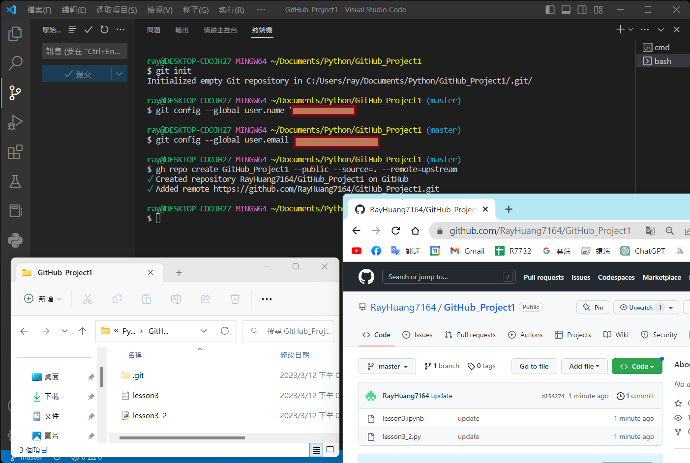

# 目錄
## [Step1 安裝Python](#Install_Python)
## [Step2 安裝Git](#Install_Git)
## [Step3 安裝VSCode](#Install_VSCode)
## [Step4 連結GitHub](#Link_GitHub)
## [Step5 專案內快速開啟VSCode](#Open_Vscode)
## [Step6 ssh Record 清除](#ssh_Record)

# Step1 安裝Python

### 官網下載Python   
- https://www.python.org/
- 有舊版本的要先使用安裝檔進行完全移除Uninstall
- 原本的安裝資料夾也需全部移除

# 版本選擇(選擇通用且穩定的版本)

- Colab
- https://colab.research.google.com/

- Python 3.9.16 =>但是此板沒有Windows

#
# 選穩定的(使用系統管理員身分執行安裝)
- https://www.python.org/downloads/windows/

-  

# Install_Python Customize Path
-  

# Install_Python Setup Path
-  

# Install_Python Path Length Limit
-  

# Install_Python 環境確認
-  

# Step2 安裝Git

### 官網下載Git
- https://git-scm.com/

# 版本選擇
-  

# Install_Git 重要設定
-  

# Install_Git 環境確認
-  

# Step3 安裝VSCode

### 官網下載VSCode
- https://code.visualstudio.com/

# VSCode 1 登入畫面
- 

# VSCode 2 延伸模組=>中文化
- 
- 重新啟動後
- 

# VSCode 3 設定自動儲存
- 
- 

# VSCode 4 延伸模組=>安裝Python輔助工具
- 

# VSCode 5 建立專案資料夾
- 
- 

# VSCode 6 建立ipynb (JupyterNotebook)
- 
# 選擇JupyterNotebook使用Python版本
- 
# 接受JupyterNotebook安裝相關套件
- 

# VSCode 7 建立py檔案
- 

# 選擇Python運行版本
- 

# Check Function link
- 

# 打開終端機
- 

# 修改預設終端機
- 

# Windows Python 預設啟用程式 
- (錯誤時會卡住 Ctrl+C 跳出)
- 
- 

# Step4  連結GitHub
# 1.先申請並驗證通過個人GitHub帳號
- https://github.com/

# 2.下載並安裝GitHub CLI (指令在Manual內)
- https://cli.github.com/

# 3.VSCode重啟新增Git Bash
- 

# 4.建立Git在專案內並設定相關資料
- https://git-scm.com/book/zh-tw/v2/%E9%96%8B%E5%A7%8B-%E5%88%9D%E6%AC%A1%E8%A8%AD%E5%AE%9A-Git

# 專案資料夾建立git進行專案管理
- git init 
- ls -al 確定.git隱藏檔有出現
# 設定識別資料
'''
$ git config --global user.name "John Doe"

$ git config --global user.email johndoe@example.com
'''
-

# 5.GitHub_Link
- gh auth login 
- https://cli.github.com/manual/
- 
- 
- 

# 6.建立資料夾在GitHub端
- gh repo 專案資料夾名稱 --public --source=. --remote=upstream
- 

# 7.同步資料在GitHub端
- 

# Step5 專案內快速開啟VSCode

- 

# Step6 ssh Record 清除
- 連不上時刪除所有記錄
- 此文件內所有東西刪掉

- 
