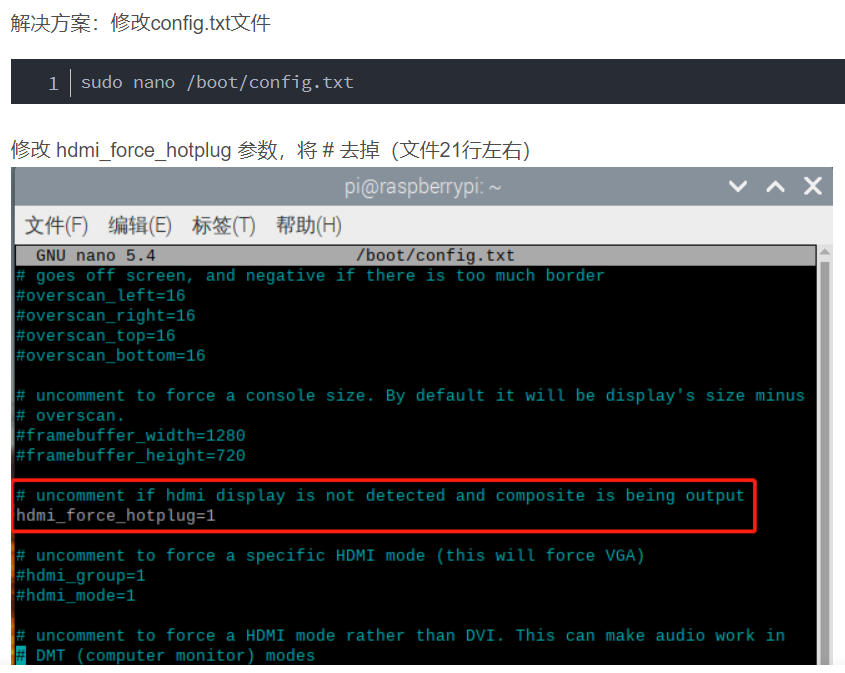

# 目錄
## [Step1 安裝Raspberry Pi OS](#Install_RaspberryPiOS)
## [Step2 Raspberry 連線](#Raspberry_Link)
## [Step3 開啟Raspberry 設定](#putty)
## [Step4 VNC 連線](#VNC_Link)

# Step1 安裝Raspberry Pi OS

### 官網下載Raspberry Pi OS 
- https://www.raspberrypi.com/software/
- 

# 安裝RaspberryPiOS_imager_1.7.4.exe
-  

# Install_Raspberry Pi OS
-  

# Install_Raspberry Pi OS 設定
- 建立名稱、開啟SSH
-  

# 建立使用者帳號、密碼、WiFi (才能直接連線)
-  
- 
- 

# Step2 Raspberry 連線

### 確定RaspberryPi 開機、連線
# 確定連接到
-  

# 電腦連線並確定 RobertRay IP
- ping RobertRay.local -4
-  

# Step3 開啟Raspberry 設定

### 官網下載putty
- https://www.putty.org/

# 1.putty.exe 輸入IP
- 
- 

# 2.輸入帳號密碼
- 

# 3.Raspberry Pi SSH Link
https://alwaysai.co/docs/reference/raspberry_pi_setup.html
# sudo raspi-config
- 
- Interface Options 全部打開
- 
- 

# Step4  VNC 連線
# 1.下載並安裝VNC-Viewer
- https://www.realvnc.com/en/connect/download/viewer/

# 2.VNC 使用 IP 登入
- 

# 3.如果出現這個需接上顯示器調整螢幕
- 
- 修改設定檔 (重啟)
- sudo nano /boot/config.txt
- 

