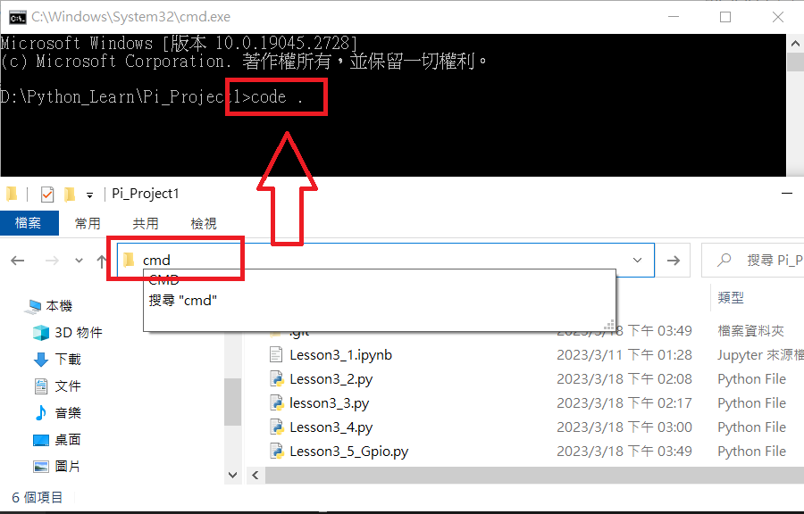
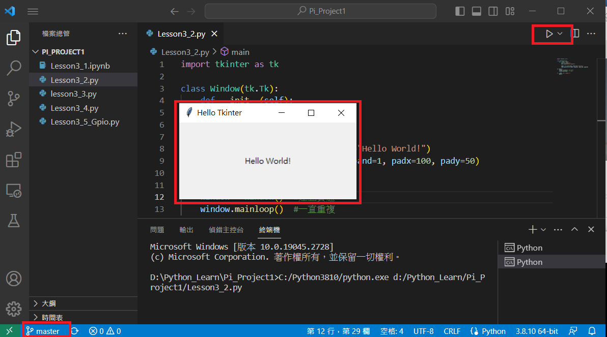

# 目錄
## [Step1 VScode Windows端開啟Py](#VScode_Windows)
## [Step2 VScode Raspberry 連線](#VScode_Raspberry)
## [Step3 開啟Raspberry 設定](#putty)
## [Step4 VNC 連線](#VNC_Link)

# Step1 VScode Windows端開啟Py

# 專案資料夾下CMD => Code . 
- 呼叫VsCode
-  

# 專案資料夾下CMD => Code . 
- 呼叫VsCode
-  

# 可以直接執行會在DOS環境顯示結果
-  

# Step2 VScode Raspberry 連線

# 確定連接到
-  

# 電腦連線並確定 RobertRay IP
- ping RobertRay.local -4
-  

# Step3 開啟Raspberry 設定

### 官網下載putty
- https://www.putty.org/

# 1.putty.exe 輸入IP
- 
- 

# 2.輸入帳號密碼
- 

# 3.Raspberry Pi SSH Link
https://alwaysai.co/docs/reference/raspberry_pi_setup.html
# sudo raspi-config
- 
- Interface Options 全部打開
- 
- 

# Step4  VNC 連線
# 1.下載並安裝VNC-Viewer
- https://www.realvnc.com/en/connect/download/viewer/

# 2.VNC 使用 IP 登入
- 

# 3.如果出現這個需接上顯示器調整螢幕
- 
- 

