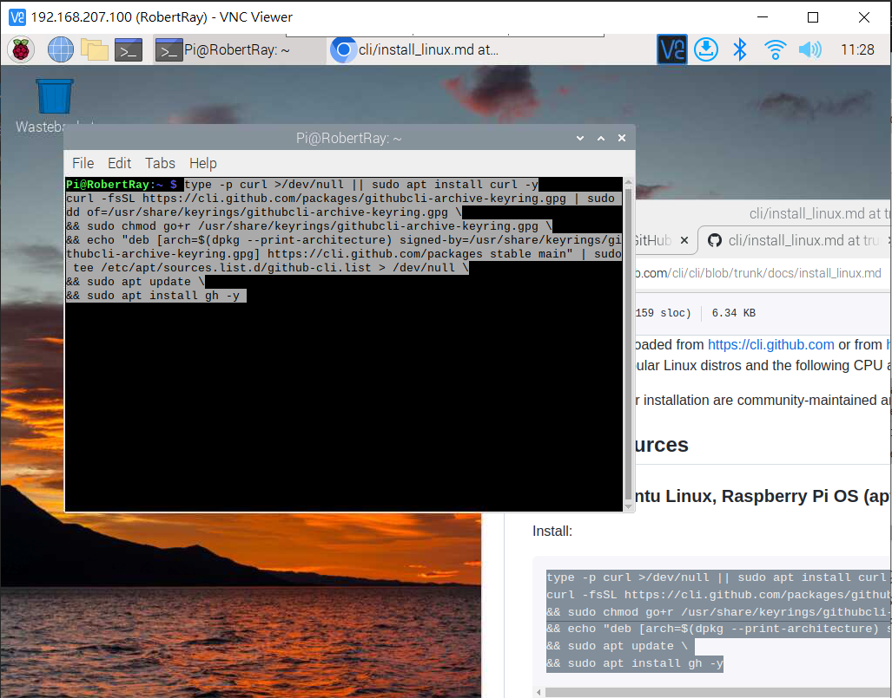

# 目錄
## [Step1 Raspberry clone GitHub](#Raspberry_clone_GitHub)
## [Step2 VScode Windows端開啟Py](#VScode_Windows)
## [Step3 VScode Raspberry 連線](#VScode_Raspberry)
## [Step4 Thonny 同步驗證](#Thonny_Link)

# Step1 Raspberry clone GitHub

# 1.VNC -> Open terminal
-  

# 2.Find Command
- https://cli.github.com/
-  
-  
-  

# 3.在terminal執行
- 

# 4.登入Git
- git config --global user.name "John Doe"
- git config --global user.email johndoe@example.com
- 

# 5.gh auth login
- 

# 6.gh repo clone 同步
- gh repo clone https://github.com/RayHuang7164/Pi_Project1
- 

# Step2 VScode Windows端開啟Py

# 專案資料夾下CMD => Code . 
-  

# 可以直接執行會在DOS環境顯示結果
-  

# Step3 VScode Raspberry 連線

# Connect to Host
- 

# 帳號@IP
-  

# password
-  

# Open terminal
-  

# Step4 Thonny 同步驗證
- 
- 